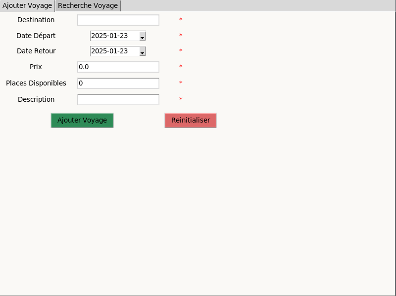
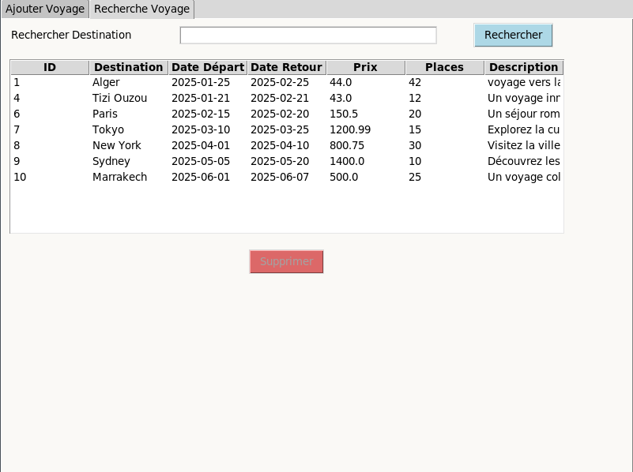

# Travel Agency App - MVC Application ✈️  

This project is a travel management application designed to assist travel agencies in managing their offers. The application is built using Python, MySQL, and Tkinter and follows the **Model-View-Controller (MVC)** architecture to ensure modularity and ease of maintenance.  

---

## Features  

- 🌟 **Add Travel Offers**: Enter travel details such as destination, departure and return dates, price, available seats, and description.  
- 🔍 **Search Functionality**: Easily find trips by searching destinations.  
- 🗂️ **Display All Trips**: View all available trips in a simple, user-friendly interface.  
- ❌ **Delete Trips**: Remove specific trips from the system.  
- ✅ **Error Handling and Feedback**: Provides clear error messages and confirmations for user actions.  

---

## Architecture  

The application is based on the **MVC architecture**, which separates concerns for better maintainability:  

1. **Model**: Manages the database operations (CRUD) using MySQL.  
2. **View**: Provides a graphical user interface (GUI) built with Tkinter.  
3. **Controller**: Acts as an intermediary, handling user inputs and coordinating between the model and the view.  

---

## Installation  

### Prerequisites  
- Python 3.x installed on your system.  
- MySQL server installed and running.  

### Steps  

1. Clone the repository:  
   ```bash
   git clone https://github.com/username/travel-management.git
   cd travel-management
   
2. Install the required Python packages:
    ```bash
    pip install mysql-connector-python python-dotenv
    
3. Create a .env file in the root directory and add your database credentials:
    ```env
    HOST=your_host
    USERNAME=your_username
    PASSWORD=your_password
    
4. Run the application: 
    ```bash
    python main.py

## Usage
1. **Add a Trip** : Fill in the form with the trip details and click "Add".
2. **Search** : Enter a destination in the search bar and view the results.
3. **View All Trips** : Click the "Show All" button to see the list of all trips.
4. **Delete a Trip** : Select a trip from the list and click "Delete".

## Screenshots 


 
## Future Improvements

* Add a feature to update trip details.
* Implement advanced search filters (e.g., by price, date range, or availability).
* Enhance the UI using PyQt or a modern framework.
* Add support for multiple languages.

## Contributing

Contributions are welcome! Feel free to fork this repository, create a new branch, and submit a pull request.

## License 

This project is licensed under the MIT License. See the LICENSE file for more details.

## Contact 

For any questions or feedback, please contact: 
    
**Missipsa GHERNAOUT**
* Email: ghernaoutmissipsa.pro@gmail.com
* GitHub: missipsag


